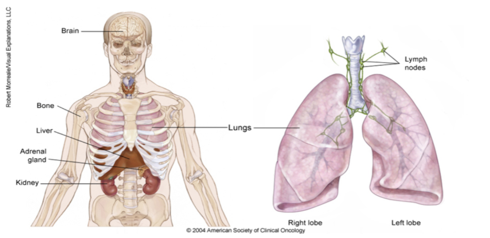

# Predicting Lung Cancer - Machine learning for predicting lung cancer.

## Description

Welcome to the solution **Predicting Lung Cancer** - a Machine learning framework - An example for your projects

Machine learning for predicting lung cancer.
    
## Explanation of each Machine Learning Model:

1. **Logistic Regression** : A linear model used for binary classification that estimates the probability of a sample belonging to a particular class.

2. **Decision Tree**: A tree-like model that splits the data into subsets based on the value of input features, making decisions based on feature values to classify instances.

3. **K-Nearest Neighbor (KNN)**: A non-parametric method used for classification by finding the 'k' nearest data points in the feature space and assigning the most common class among them to the query point.

4. **Gaussian Naive Bayes** : A probabilistic classifier based on Bayes' theorem with the assumption of independence among features, often used for text classification tasks.

5. **Multinomial Naive Bayes**: Similar to Gaussian Naive Bayes but specifically designed for classification tasks with discrete features, such as word counts in text classification.

6. **Support Vector Classifier (SVC)**: A supervised learning algorithm that finds the hyperplane that best separates classes in a high-dimensional space, often used for binary classification.

7. **Random Forest**: An ensemble learning method that constructs multiple decision trees during training and outputs the mode of the classes (classification) or the mean prediction (regression) of the individual trees.

8. **XGBoost**: An optimized gradient boosting library that implements machine learning algorithms under the Gradient Boosting framework, known for its speed and performance in handling large datasets.

9. **Multi-layer Perceptron (MLP)**: A type of artificial neural network composed of multiple layers of nodes (neurons) that can learn non-linear relationships between input and output data.

10. **Gradient Boosting Classifier**: A machine learning technique that builds an ensemble of weak learners (typically decision trees) in a sequential manner, with each tree correcting the errors of its predecessors, resulting in a strong predictive model.

## Notebook Features
- Self Documenting 
- Self Testing 
- Easily Configurable
- Includes Talking Code - The code explains itself
- Self Logging 
- Self Debugging 
- Low Code - or - No Code
- Educational 
    

    